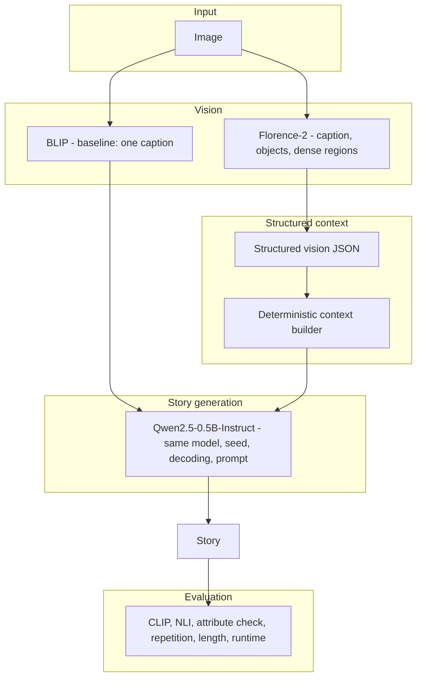

<div align="center">

# Image → Story

**A fully local visual storytelling pipeline that turns images into structured visual context, generates stories, and measures image–story grounding.**


```text
IMAGE  →  VISUAL UNDERSTANDING  →  STRUCTURED CONTEXT  →  QWEN STORY GENERATION  →  AUTOMATIC EVALUATION
```

</div>

> **In one paragraph.** A baseline that gives the story model a single BLIP sentence is compared with a pipeline that gives it a structured Florence-2
> description. Both use the same Qwen2.5-0.5B model, seed, decoding, prompt and metric. On this 8-image, one-run sample the structured pipeline was associated
> with higher mean grounding and lower NLI contradiction, with regressions, a tied length-controlled pass rate and a much higher generation cost.
> The result shows a direction on this sample, not a proven improvement. See [Results](#results) and [Limitations](#limitations).

## Example Preview

Two of the 8 images, chosen by a fixed rule: the largest grounding-score improvement and the largest regression in the normal run (`results_final.csv`). Stories are copied unchanged. All 8 are in the [full gallery](#visual-examples).

<table>
<tr>
<th>Improved: <code>thumb-chihiro002.png</code></th>
<th>Regressed: <code>thumb-chihiro004.png</code></th>
</tr>
<tr>
<td align="center"><br/>Grounding 0.644 → <b>0.911</b> (+0.267)<br/>Words 47 → 65</td>
<td align="center"><br/>Grounding 0.895 → 0.823 (-0.073)<br/>Words 30 → 59</td>
</tr>
<tr>
<td valign="top"><b>Baseline:</b> A woman sits alone on a rocky outcropping, gazing out at the car that drives by. The sun sets over the horizon, casting long shadows across the landscape. She takes a deep breath, feeling the cool breeze on her face as she watches the world pass by.<br/><br/><b>Improved:</b> In the heart of the dense forest, a young girl stood beside a large green monster statue, her eyes sparkling with laughter as she gazed at the towering figure. She wore a simple green dress and a pair of sturdy boots, her face a mix of mischief and innocence. The car, its headlights casting long shadows, passed by, its occupants oblivious to the child&#x27;s presence.</td>
<td valign="top"><b>Baseline:</b> A man and woman sit at a table, sipping on coffee and savoring their meal. The aroma of freshly baked bread fills the air as they chat about their day.<br/><br/><b>Improved:</b> In the bustling restaurant, the family sat at a table, their faces all focused on their meal. The man, with his golden fur and expressive eyes, was savoring his hot dog. The woman, with her long hair and a mischievous grin, was munching on a red fish. The child, with a curious look, watched them both with wide eyes.</td>
</tr>
</table>

## At a Glance

| Item | Details |
|---|---|
| Challenge | Image → Story — Modules 7 & 10 |
| Baseline | BLIP → Qwen2.5-0.5B (a stand-in, not the official instructor baseline) |
| Improved vision | Florence-2-base |
| Evaluation | CLIP + NLI + attribute checks + repetition + length + runtime |
| Execution | Fully local / offline |
| Hardware | CPU |
| Dataset in this repository | 8 evaluation frames (`images/`) |
| Final normal comparison | `results_final.csv` |
| Final length-controlled comparison | `results_final_fixlen.csv` |

## What This Project Demonstrates

- How a **one-sentence vision bottleneck** affects downstream story generation.
- How **richer structured visual context** changes the information available to the language model.
- How to build **automatic grounding proxies** (CLIP, NLI, attribute checks) and what each one can and cannot see.
- How to **measure runtime separately from evaluation cost**.
- How to **report regressions and limitations honestly** next to the gains.

## Contents

[Problem](#problem) · [Baseline](#baseline) · [Improved Pipeline](#improved-pipeline) · [Structured Vision Context](#structured-vision-context) ·
[Experimental Fairness](#experimental-fairness) · [Evaluation](#evaluation) · [Results](#results) · [Failure Cases & Regressions](#failure-cases--regressions) ·
[Limitations](#limitations) · [Multi-Image Story](#multi-image-story) · [Installation](#installation) · [Usage](#usage) · [Testing](#testing) ·
[Reproducing Results](#reproducing-results) · [Project Structure](#project-structure) · [Visual Examples](#visual-examples)

---

## Problem

```text
IMAGE  →  BLIP  →  ONE SENTENCE  →  QWEN  →  STORY
```

> The language model never sees the image directly. Its entire visual understanding is compressed into one sentence.

The story model therefore loses detail and fills the gaps with invented ones. Failures observed in the baseline output:

| Failure | What happened |
|---|---|
| Length | 0/8 baseline stories are 80–120 words (range 30–76); the baseline's only built-in check is word count |
| Unsupported detail | `chihiro003.jpg`: the caption is "a painting of a street scene with a man walking down the street" and the story adds "jeans and a t-shirt that shows off his muscular build" |
| Unsupported breed | `thumb-chihiro008.png`: the caption mentions "a man and a dog" and the story calls the dog "a golden retriever" |
| Generic scene | `thumb-chihiro007.png`: the caption is "a restaurant with a table and chairs" and the story adds coffee, bread and a waiter that nothing in the input supports |

## Baseline

`Image → BLIP (Salesforce/blip-image-captioning-base) → one sentence → Qwen2.5-0.5B-Instruct → story`

> **The original instructor baseline code was unavailable, so this repository uses a stand-in baseline** that matches the documented
> architecture (BLIP caption → Qwen2.5-0.5B-Instruct, 80–120 word story). It is not the exact official baseline, and its absolute
> numbers may differ from the official one.

## Improved Pipeline

<table>
<tr>
<td valign="top" width="50%"><b>Baseline</b>
<pre>
Image
 ↓
BLIP
 ↓
Single caption
 ↓
Qwen2.5-0.5B
 ↓
Story
</pre></td>
<td valign="top" width="50%"><b>Improved</b>
<pre>
Image
 ↓
Florence-2
 ├─ Detailed caption
 ├─ Object detection
 └─ Dense region captions
        ↓
Structured Vision JSON
        ↓
Deterministic Context Builder
        ↓
Qwen2.5-0.5B
        ↓
Story
</pre></td>
</tr>
</table>

> **What changed — Module 7:** replace BLIP's single-sentence image understanding with Florence-2 structured visual extraction.
>
> The detailed caption, object detection, dense region captions, the structured JSON and the context builder are implementation components of this richer
> seeing stage. **They were not ablated separately**, so any gain cannot be attributed to one of them.



- `seeing.py` runs Florence-2-base (`florence-community/Florence-2-base`, greedy decoding, CPU) with three tasks: `<MORE_DETAILED_CAPTION>`,
  `<OD>` and `<DENSE_REGION_CAPTION>`, then derives `characters`, `actions`, `spatial_relations` and `style_or_mood` from that text with
  fixed keyword lists (closed vocabularies; see [Limitations](#limitations)). `<OCR>` is disabled (it returned junk on anime frames).
- `context_builder.py` is deterministic and has no ML and no image-specific vocabulary. It keeps the detected object labels in order,
  adds up to 5 further object descriptions, up to 3 region descriptions, and trims to 180 words.

## Structured Vision Context

> Instead of passing one caption downstream, the improved pipeline preserves multiple visual signals in a structured representation.

| Field | Purpose |
|---|---|
| `scene` | High-level scene |
| `characters` | Character / entity labels |
| `objects` | Visual objects (detection labels plus further object descriptions) |
| `od_labels` | Object-detection labels only; used for entity matching across frames |
| `actions` | Detected actions |
| `spatial_relations` | Spatial evidence |
| `region_descriptions` | Local visual details |
| `style_or_mood` | Visual tone |
| `ocr_text` | OCR output; always empty here because `<OCR>` is disabled (it returned junk on anime frames) |

```json
{
  "image_id": "...", "scene": "...", "description": "...",
  "objects": ["..."], "od_labels": ["..."], "characters": ["..."], "actions": ["..."],
  "relationships": [], "spatial_relations": [], "region_descriptions": ["..."], "style_or_mood": "...",
  "ocr_text": "", "runtime_s": 0.0, "model_load_s": 0.0
}
```

Fields are filled only from model output.

## Experimental Fairness

| Controlled factor | Baseline | Improved |
|---|---|---|
| Story model | Qwen2.5-0.5B-Instruct | Same |
| Seed | 0 | Same |
| Decoding | Greedy | Same |
| Repetition penalty | 1.05 | Same |
| Story prompt template | Same | Same |
| Evaluation formula and threshold | Same | Same |
| Length control (`--fix-length`) | Same mechanism | Same mechanism |
| **Difference** | BLIP seeing | Florence-2 seeing |

> **Fair-comparison rule:** the intended difference is the seeing stage and the context produced from it. Model loading is excluded from every per-image runtime.

**Length-controlled generation** (`--fix-length`): up to 3 greedy attempts with progressively stricter length prompts. Each attempt is cut to whole sentences
(a cut-off last sentence is dropped) and to at most 120 words. The first attempt with 80–120 words is returned; otherwise the attempt closest to
100 words. This does **not** produce equal word counts for the two pipelines.

## Evaluation

### Image-aware signal

- **CLIP image–story similarity** (`clip_image_story_mean`): cosine similarity between the **image** and each story sentence (ViT-B/32), averaged;
  `clip_n = clip((cos − 0.15) / 0.15, 0, 1)`. **The only component of the grounding score that looks at the image itself.**

### Textual consistency signals

- **NLI contradiction** (`nli_contra_mean`): mean contradiction probability between the supplied context (caption or structured context) and each story sentence.
  It measures **textual consistency with the extracted visual context**; it is not independent verification of the image.
- **Attribute conflict** (`attribute_conflict`): deterministic check of colour and material words — a different colour or material than the context names, or a material whose
  usual colour the context's colour excludes. It is a heuristic and can raise false alarms.

> **Example failure this check is built to catch** (from the challenge text, covered by a unit test; it did not occur in the 8-image runs)
>
> - Context: "the cabinets are white"
> - Story: "the old oak cabinet stood tall"
> - Metric: `attribute_conflict = oak`
>
> A pure word-count check would miss this class of failure.

### Generation quality

- **Repetition**: fraction of repeated word trigrams (reported only).
- **Length validity** (`length_valid`): `80 ≤ words ≤ 120`. A benchmark requirement, **not** a quality measure — a story can be well aligned but too short, or the right length and visually wrong.

### Runtime

```text
Generation                       Evaluation
├── Vision / seeing              ├── CLIP
├── Story generation             ├── NLI
└── Total (generation_s)         └── Rules   → eval_total_s
```

Measured with `time.perf_counter`, model loading excluded. **Evaluation runtime is reported separately and is not included in generation runtime.**

### Multi-image only

- **Entity consistency**, **transition markers** and **adjacent similarity**: a lightweight structural proxy based on entity overlap and transition words.
  It does not fully evaluate narrative coherence. For ordinary single-image evaluation these metrics are not computed or reported.

### Grounding score and pass rule

```text
grounding_score =
    0.4 × clip_n
  + 0.4 × (1 − nli_contra_mean)
  + 0.2 × attribute_consistency        (1 if no attribute conflict, else 0)

grounding_pass =
    grounding_score ≥ 0.60
    AND no attribute conflict
    AND length_valid
```

> **This is a composite proxy, not ground truth.** The 0.60 threshold and the CLIP range are untuned.

---

## Results

Source of truth: `results_final.csv` (normal) and `results_final_fixlen.csv` (length-controlled), 8 images, one run each, 16/16 evaluations succeeded in each.
Bold marks the improved value only where it is better than the baseline.

### Normal run

| Metric | Baseline | Improved | Change |
|---|---:|---:|---:|
| Grounding score | 0.783 | **0.856** | +0.072 |
| CLIP image-story similarity | 0.233 | **0.257** | +0.024 |
| NLI contradiction (lower is better) | 0.098 | **0.075** | -0.023 |
| Repetition rate (lower is better) | 0.0034 | 0.0187 | +0.0154 |
| Length valid (80-120 words) | 0/8 | **1/8** |  |
| Grounding pass | 0/8 | **1/8** |  |
| Mean words per story | 56.6 | 62.6 |  |

Images improved / regressed (grounding score): **5 / 3**

### Length-controlled run (`--fix-length`)

| Metric | Baseline | Improved | Change |
|---|---:|---:|---:|
| Grounding score | 0.756 | **0.827** | +0.070 |
| CLIP image-story similarity | 0.240 | **0.254** | +0.014 |
| NLI contradiction (lower is better) | 0.207 | **0.061** | -0.145 |
| Repetition rate (lower is better) | 0.0068 | **0.0034** | -0.0034 |
| Length valid (80-120 words) | 6/8 | 6/8 |  |
| Grounding pass | 5/8 | 5/8 |  |
| Mean words per story | 92.8 | 93.1 |  |

Images improved / regressed (grounding score): **5 / 3**

```text
Normal:
Improved  █████    5/8
Regressed ███      3/8

Length-controlled:
Improved  █████    5/8
Regressed ███      3/8
```

### What moved

- Mean grounding score is higher for the improved pipeline in both runs (0.783 → 0.856 and 0.756 → 0.827).
- CLIP image–story similarity is higher (0.233 → 0.257 and 0.240 → 0.254).
- NLI contradiction is lower (0.098 → 0.075 and 0.207 → 0.061).

### What did not improve

- Under length control the grounding-pass rate is tied (5/8 vs 5/8).
- 3 of 8 images regressed in the normal run and 3 of 8 in the length-controlled run.
- The normal-run pass change (0/8 → 1/8) mostly reflects length: only 1/8 improved stories are 80–120 words.
- Generation time increased substantially (see [Runtime](#runtime-1)).
- Repetition is higher for the improved pipeline in the normal run (0.0034 → 0.0187) and lower in the length-controlled run
  (0.0068 → 0.0034); repeated trigrams are rare in absolute terms, so this is not a finding.

### What the evidence supports

- Both comparisons used 8 images and a single run, with an untuned threshold, so the sizes are indicative only.
- The gain depends on how the context is formatted: the same Florence-2 model gave different gains in earlier versions of the context builder
  (see [Result Artifacts](#result-artifacts)). With 8 images and one run this cannot be separated from run-to-run variation.

> ### Key takeaway
>
> On this 8-image, one-run sample, the Florence-2 structured seeing pipeline was associated with higher mean grounding and lower NLI contradiction, while retaining
> regressions, tied length-controlled pass rates, and substantially higher generation cost. The result shows a direction on this sample, not a proven improvement.

### Per-image evidence

Change = improved grounding − baseline grounding: `+` improved, `-` regressed.

**Normal run**

| Image | Baseline | Improved | Change | Δ CLIP | Δ NLI | Words (base / impr) |
|---|---:|---:|---:|---:|---:|---:|
| `chihiro003.jpg` | 0.740 | 0.856 | +0.116 | +0.032 | -0.075 | 71 / 99 |
| `thumb-chihiro001.png` | 0.856 | 0.817 | -0.039 | -0.010 | +0.033 | 45 / 66 |
| `thumb-chihiro002.png` | 0.644 | 0.911 | +0.267 | +0.068 | -0.218 | 47 / 65 |
| `thumb-chihiro004.png` | 0.895 | 0.823 | -0.073 | -0.020 | +0.050 | 30 / 59 |
| `thumb-chihiro005.png` | 0.722 | 0.841 | +0.119 | +0.051 | +0.042 | 50 / 41 |
| `thumb-chihiro006.png` | 0.878 | 0.975 | +0.097 | +0.029 | -0.047 | 58 / 66 |
| `thumb-chihiro007.png` | 0.787 | 0.750 | -0.037 | -0.011 | +0.019 | 76 / 52 |
| `thumb-chihiro008.png` | 0.746 | 0.873 | +0.127 | +0.050 | +0.013 | 76 / 53 |

**Length-controlled run**

| Image | Baseline | Improved | Change | Δ CLIP | Δ NLI | Words (base / impr) |
|---|---:|---:|---:|---:|---:|---:|
| `chihiro003.jpg` | 0.800 | 0.887 | +0.087 | +0.033 | +0.001 | 107 / 110 |
| `thumb-chihiro001.png` | 0.811 | 0.783 | -0.027 | +0.009 | +0.129 | 66 / 114 |
| `thumb-chihiro002.png` | 0.691 | 0.712 | +0.021 | +0.049 | -0.224 | 86 / 116 |
| `thumb-chihiro004.png` | 0.902 | 0.827 | -0.075 | -0.020 | +0.054 | 52 / 59 |
| `thumb-chihiro005.png` | 0.677 | 0.821 | +0.145 | +0.019 | -0.236 | 112 / 61 |
| `thumb-chihiro006.png` | 0.905 | 0.851 | -0.054 | -0.033 | -0.086 | 82 / 106 |
| `thumb-chihiro007.png` | 0.777 | 0.911 | +0.133 | +0.031 | -0.127 | 117 / 92 |
| `thumb-chihiro008.png` | 0.488 | 0.820 | +0.333 | +0.024 | -0.675 | 120 / 87 |

### Runtime

| Mean seconds per image (model loading excluded) | Baseline (normal) | Improved (normal) | Baseline (length-controlled) | Improved (length-controlled) |
|---|---:|---:|---:|---:|
| Vision / seeing | 1.4 | 15.5 | 1.5 | 16.5 |
| Story generation | 6.3 | 7.1 | 22.2 | 21.9 |
| **Generation total** | **7.7** | **22.6** | **23.7** | **38.5** |
| Evaluation (CLIP + NLI + rules) | 0.92 | 1.22 | 1.17 | 1.94 |

Seeing is slower with Florence-2 (three tasks instead of one BLIP call), and length control multiplies story time because of retries.
Per-image evaluation time varies; the median `eval_total_s` is 0.93 s (normal) and 1.27 s (length-controlled).

### Why the experiment is useful

- A one-sentence visual bottleneck can cause downstream hallucination.
- Richer visual context can help some scenes, and can also introduce new errors.
- Evaluation has to expose both gains and regressions.
- Runtime belongs in the engineering trade-off.

---

## Failure Cases & Regressions

### `thumb-chihiro001.png`

**Regression:** -0.039 normal / -0.027 length-controlled.
**Cause observed:** the structured context contains both "girl" and "boy" for the same figure (`Characters: girl, boy, human`).
The story model receives that context, and neither the NLI nor the attribute check compares against anything else.

### `thumb-chihiro004.png`

**Regression:** -0.073 normal / -0.075 length-controlled.
**Cause observed:** the characters list contains "dog". It comes from the region caption "man eating hot dog": the keyword matcher in `seeing.py` matched the word "dog" inside "hot dog".
This is an extraction artifact, not a detected dog. A fix would change the contexts and require new runs, so it is documented rather than changed.

### `thumb-chihiro006.png` and `thumb-chihiro007.png`

- `thumb-chihiro006.png` regressed only in the length-controlled run (+0.097 normal / -0.054 length-controlled).
- `thumb-chihiro007.png` regressed only in the normal run (-0.037 normal / +0.133 length-controlled).
- No specific cause was isolated; see the per-image tables above.

### Other failure observations

- **Attribute conflicts:** the attribute check fired on 1 of 32 scored rows (`thumb-chihiro002.png`, improved, length-controlled: "red"). It contributes almost nothing to these results.
- **Length:** Qwen2.5-0.5B does not reliably hit 80–120 words; 1/8 (normal) and 6/8 (length-controlled) improved stories are in range.

---

## Limitations

| Limitation | Consequence |
|---|---|
| Stand-in baseline | Absolute numbers may differ from the official baseline |
| 8 images, one run, seed 0 | Weak statistical confidence; sizes are indicative only |
| Untuned threshold (0.60) and CLIP range | The score is a proxy, not ground truth |
| CLIP is the only image-aware signal; NLI and the attribute check compare against generated text | Errors made by the seeing stage propagate into the story and are not penalised by them |
| Closed vocabularies (character and action keywords in `seeing.py`; colour, material and transition words in `metric.py`) | Some entities and conflicts are missed; the "hot dog" artifact comes from this approach |
| Attribute check is a word-list heuristic with a typical-colour rule for wood | Can raise false alarms and misses most conflicts |
| Continuity is an overlap-and-lexicon proxy; generic recurring labels (for example "person") count like any other | It does not measure narrative coherence |
| Components of the improved seeing stage were not ablated | Gains cannot be attributed to individual vision components |
| No fluency or narrative-quality metric | Fluency and coherence are not directly measured |

> **Experiment status**
>
> Reproducible local prototype. Results are evidence from one controlled sample, not a statistically validated benchmark.

---

## Multi-Image Story

```text
Image 1 ─┐
Image 2 ─┤
Image 3 ─┤
...      ├──> Sequence Context ──> One Story
Image N ─┘
```

`python main.py images/ --multi` builds a sequence context in filename order; its continuity notes list only entities that occur in at least two different frames. File names are not shown to the story model.
Current run: all 8 images, 333 words, cut-off final sentence removed: True.

| Measured structural proxy | Value |
|---|---|
| Recurring entities (11) | boy, chair, child, footwear, girl, human, human face, man, person, window, woman |
| Entity consistency | 0.4545 |
| Transition markers | 0 |
| Adjacent similarity | 0.2285 |

**Not measured:** true narrative coherence and long-range story quality. These numbers describe lexical overlap only. The story is in `combined_story.json`; it still invents a named
character ("Leo") and relatives that no frame shows, and covers the frames unevenly. A 0.5B model cannot hold a long sequence prompt, so treat it as a demonstration, not as evidence of coherence.

---

## Installation

Tested on Python 3.13, Windows 11, CPU only, about 8 GB RAM for the model weights.

```powershell
pip install -r requirements.txt
python download_models.py
```

> Models must be downloaded once before offline execution.

Models: `Salesforce/blip-image-captioning-base`, `Qwen/Qwen2.5-0.5B-Instruct`, `florence-community/Florence-2-base`,
`openai/clip-vit-base-patch32`, `cross-encoder/nli-MiniLM2-L6-H768`.

### Offline verification

```powershell
$env:HF_HUB_OFFLINE = "1"
$env:TRANSFORMERS_OFFLINE = "1"
python main.py images/ --both
```

The code sets `HF_HUB_OFFLINE=1` and `TRANSFORMERS_OFFLINE=1` itself; nothing needs the internet at inference time. It respects an existing `HF_HOME`; otherwise Hugging Face's normal cache
location is used. A custom cache is optional, for example:

```powershell
$env:HF_HOME = "D:\AI-Models\huggingface"   # optional; not required
```

## Usage

**Baseline**

```powershell
python main.py images/ --baseline
```

**Improved**

```powershell
python main.py images/ --improved
```

**Compare**

```powershell
python main.py images/ --both --output results_final.csv --vision-json vision_final.json
```

**Length-controlled**

```powershell
python main.py images/ --both --fix-length --output results_final_fixlen.csv --vision-json vision_final_fixlen.json
```

**Multi-image**

```powershell
python main.py images/ --multi
```

**Metric self-test**

```powershell
python metric.py
```

| Flag | Purpose |
|---|---|
| `--baseline` | Run the BLIP baseline |
| `--improved` | Run the Florence-2 pipeline |
| `--both` | Run both and compare (default) |
| `--multi` | Generate one story across the sequence (filename order) |
| `--fix-length` | Length-controlled generation (not used by `--multi`) |
| `--output` | CSV output (default `results.csv`) |
| `--vision-json` | Structured vision JSON output (default `vision.json`) |
| `--multi-output` | Multi-image result JSON (default `combined_story.json`) |

> **`results.csv` is also a historical result file in this repository, so always pass `--output` when you do not want to overwrite it.** A failing image is recorded with `status=error` and an error message,
> gets no metric values, and is excluded from the means; the run prints successful and failed evaluation counts.

## Testing

```powershell
python test_pipeline.py            # unit tests, no model inference
python test_pipeline.py --models   # also the model-dependent tests
pytest -q                          # 24 passed, 2 skipped
```

```text
24 unit tests
 2 model-dependent tests (CLIP/NLI scoring, Florence-2 vision); skipped unless --models or RUN_MODEL_TESTS=1
```

Importing `metric` loads CLIP and the NLI model from the local cache, so the cache must exist. The unit tests call production code:
the grounding formula helper, the grounding-pass rule, the 79/80/120/121 word-count boundaries, the attribute check (including the "white cabinets" vs "oak cabinet"
challenge example), repetition, continuity (including "recurring means at least two frames" and "not applicable for one image"), the context builder, image discovery,
CSV writing, error rows, summaries, `--vision-json` handling, and configuration.

## Reproducing Results

Experiment protocol: offline mode, seed 0, greedy decoding, the same models and the same metric for both pipelines.

```powershell
$env:HF_HUB_OFFLINE = "1"; $env:TRANSFORMERS_OFFLINE = "1"
python main.py images/ --both --output results_final.csv --vision-json vision_final.json
python main.py images/ --both --fix-length --output results_final_fixlen.csv --vision-json vision_final_fixlen.json
python main.py images/ --multi
python metric.py
python test_pipeline.py --models
```

Greedy decoding with a fixed seed makes the stories repeatable on the same machine; runtimes vary between runs.

### Result Artifacts

**Final artifacts**

| File | Contents |
|---|---|
| `results_final.csv`, `vision_final.json` | Normal comparison, 8 images × 2 pipelines |
| `results_final_fixlen.csv`, `vision_final_fixlen.json` | Length-controlled comparison (`--fix-length`) |
| `combined_story.json` | One story across all 8 images (`--multi`) with the continuity proxy |
| `selftest.csv` | Output of `python metric.py` (synthetic strings) |
| `experiments.md` | Experiment write-up |

**Historical / diagnostic artifacts** — kept as evidence, **not directly comparable with the final results**

| File | Mean grounding (baseline → improved) | Grounding pass | Length valid |
|---|---|---|---|
| `results_new.csv` — earlier structured version, normal | 0.783 → 0.866 (+0.083) | 0/8 → 2/8 | 0/8 → 2/8 |
| `results_fixlen_new.csv` — earlier structured version, length-controlled | 0.756 → 0.789 (+0.032) | 5/8 → 4/8 | 6/8 → 6/8 |
| `results.csv` — earlier simple pipeline, normal | 0.783 → 0.845 (+0.062) | 0/8 → 3/8 | 0/8 → 3/8 |
| `results_fixlen.csv` — earlier simple pipeline, length-controlled | 0.756 → 0.837 (+0.080) | 5/8 → 5/8 | 6/8 → 5/8 |

Historical files (also `results_new_vision.json`, `results_fixlen_new_vision.json` and `stories.json`) come from earlier code (an earlier simple context, and a context builder that used an object whitelist)
and from an earlier metric version, so they are kept only as evidence of how the earlier numbers were produced.

## Project Structure

```text
image-story-challenge/
├── main.py
├── baseline.py
├── seeing.py
├── context_builder.py
├── metric.py
├── test_pipeline.py
├── download_models.py
├── requirements.txt
├── images/
├── selftest_image.jpg
├── results_final.csv
├── results_final_fixlen.csv
├── vision_final.json
├── vision_final_fixlen.json
├── combined_story.json
├── selftest.csv
├── experiments.md
└── README.md
```

| File | Role |
|---|---|
| `main.py` | CLI: `--baseline` / `--improved` / `--both` / `--multi` / `--fix-length` |
| `baseline.py` | BLIP baseline and the shared Qwen story generator (length rule, length-controlled mode) |
| `seeing.py` | Florence-2 seeing stage → structured vision JSON |
| `context_builder.py` | Deterministic context and sequence-context builder, entity helpers |
| `metric.py` | Grounding score, repetition, attribute check, continuity proxy, runtime |
| `test_pipeline.py` | Unit tests and optional model-dependent tests |
| `download_models.py` | One-time model download |
| `images/` | The 8 evaluation frames |
| `selftest_image.jpg` | Test image for the metric self-test and tests |

The historical result files listed under [Result Artifacts](#result-artifacts) are also in the repository.

---

## Visual Examples

Stories below are copied programmatically from `results_final.csv` (normal run) and are not edited.

### Example 1 — `chihiro003.jpg`

<p align="center"></p>

| | Baseline (BLIP) | Improved (Florence-2) |
|---|---:|---:|
| Grounding | 0.740 | 0.856 |
| Words | 71 | 99 |

| Pipeline | Story |
|---|---|
| Baseline | A man steps out onto the bustling street, his footsteps echoing through the concrete. He's dressed in a casual yet stylish outfit, a pair of jeans and a t-shirt that shows off his muscular build. The sun is shining brightly, casting a warm glow over the cityscape below. The man's eyes are fixed on the sidewalk, looking for something to grab. He's walking slowly, taking his time to enjoy the moment. |
| Improved | In the heart of a bustling European city, a vibrant street scene unfolded. Children played joyfully under the twinkling Christmas lights, their laughter echoing through the air. A man, dressed in a festive attire, walked down the street, his eyes sparkling with excitement. He stopped at a colorful building with its windows adorned with festive decorations, which he admired with a sense of pride. As he continued, he passed by another building with its windows filled with red lanterns, creating a festive atmosphere. The street was alive with the sounds of children's laughter and the cheerful chatter of neighbors. |

### Example 2 — `thumb-chihiro001.png`

<p align="center"></p>

| | Baseline (BLIP) | Improved (Florence-2) |
|---|---:|---:|
| Grounding | 0.856 | 0.817 |
| Words | 45 | 66 |

| Pipeline | Story |
|---|---|
| Baseline | A girl sat in the back of a car, surrounded by colorful flowers. The sun shone through the window, casting a warm glow on her face. She was lost in thought as she gazed at the vibrant blooms, feeling grateful for the beauty around her. |
| Improved | In the heart of a bustling city, a young girl sat in the back seat of a sleek, modern car, her eyes fixed on the vibrant blooms around her. She held the bouquet in one hand, her fingers tracing the delicate petals with practiced ease. The scene was captured by a camera lens, capturing the essence of a moment that would soon be shared with others. |

### Example 3 — `thumb-chihiro002.png`

<p align="center"></p>

| | Baseline (BLIP) | Improved (Florence-2) |
|---|---:|---:|
| Grounding | 0.644 | 0.911 |
| Words | 47 | 65 |

| Pipeline | Story |
|---|---|
| Baseline | A woman sits alone on a rocky outcropping, gazing out at the car that drives by. The sun sets over the horizon, casting long shadows across the landscape. She takes a deep breath, feeling the cool breeze on her face as she watches the world pass by. |
| Improved | In the heart of the dense forest, a young girl stood beside a large green monster statue, her eyes sparkling with laughter as she gazed at the towering figure. She wore a simple green dress and a pair of sturdy boots, her face a mix of mischief and innocence. The car, its headlights casting long shadows, passed by, its occupants oblivious to the child's presence. |

### Example 4 — `thumb-chihiro004.png`

<p align="center"></p>

| | Baseline (BLIP) | Improved (Florence-2) |
|---|---:|---:|
| Grounding | 0.895 | 0.823 |
| Words | 30 | 59 |

| Pipeline | Story |
|---|---|
| Baseline | A man and woman sit at a table, sipping on coffee and savoring their meal. The aroma of freshly baked bread fills the air as they chat about their day. |
| Improved | In the bustling restaurant, the family sat at a table, their faces all focused on their meal. The man, with his golden fur and expressive eyes, was savoring his hot dog. The woman, with her long hair and a mischievous grin, was munching on a red fish. The child, with a curious look, watched them both with wide eyes. |

### Example 5 — `thumb-chihiro005.png`

<p align="center"></p>

| | Baseline (BLIP) | Improved (Florence-2) |
|---|---:|---:|
| Grounding | 0.722 | 0.841 |
| Words | 50 | 41 |

| Pipeline | Story |
|---|---|
| Baseline | A man in a formal suit and tie stands on a ledge, looking out over a cityscape. The sun glints off his polished leather jacket, casting a warm glow on his face. He takes a deep breath, feeling the tension in his muscles as he prepares to make a statement. |
| Improved | In a serene garden, a young man with green hair stands on a red railing, his eyes fixed on the distant balcony. He holds a small, delicate bird in his hand, its wings fluttering gently as it watches the world below. |

### Example 6 — `thumb-chihiro006.png`

<p align="center"></p>

| | Baseline (BLIP) | Improved (Florence-2) |
|---|---:|---:|
| Grounding | 0.878 | 0.975 |
| Words | 58 | 66 |

| Pipeline | Story |
|---|---|
| Baseline | A pig, with its long snout and bushy tail, was painting a picture of a man in a field. The pig's eyes were fixed on the figure, his brush strokes soft and gentle. The man's face was serene, his expression calm and composed. The pig's artistry was evident in every stroke, capturing the essence of the man's presence. |
| Improved | In a vibrant world, a pig with a blue shirt stood proudly, its eyes twinkling with mischief. Its green leafy vegetable in its mouth was a sight to behold, a testament to its hearty appetite. The scene was captured by a vibrant cartoon pig with a blue shirt and a green leafy vegetable in its mouth, adding a touch of whimsy to the otherwise mundane scene. |

### Example 7 — `thumb-chihiro007.png`

<p align="center"></p>

| | Baseline (BLIP) | Improved (Florence-2) |
|---|---:|---:|
| Grounding | 0.787 | 0.750 |
| Words | 76 | 52 |

| Pipeline | Story |
|---|---|
| Baseline | In the dimly lit restaurant, the soft glow of the overhead light bathed the tables in a warm, inviting light. The air was filled with the scent of freshly baked bread and the aroma of steaming coffee. A friendly waiter greeted each patron with a warm smile, and the conversation flowed effortlessly as they sipped their coffee and ate their meals. The atmosphere was cozy and welcoming, perfect for a special occasion or a casual dinner. |
| Improved | In the dimly lit alleyway, a bird perched on a stool, its feathers shimmering under the lantern's soft glow. The bowl sat precariously on the chair, its contents a mix of rice and vegetables, while the stool was occupied by a curious passerby who watched with a mix of curiosity and amusement. |

### Example 8 — `thumb-chihiro008.png`

<p align="center"></p>

| | Baseline (BLIP) | Improved (Florence-2) |
|---|---:|---:|
| Grounding | 0.746 | 0.873 |
| Words | 76 | 53 |

| Pipeline | Story |
|---|---|
| Baseline | In the heart of a bustling town, a man sat on a bench, his eyes fixed on a distant dog. The dog, a golden retriever, wagged its tail in greeting. The man's face lit up as he watched the dog play with a toy, its tail swishing back and forth. The dog, in turn, wagged its tail back and forth, its eyes sparkling with joy. The man smiled, feeling grateful for the simple bond between them. |
| Improved | In a dimly lit room, a woman stood before a small red building with a green door and red lights. She held a figure in her arms, which was a man. The scene was set against a dark background, with shadows playing on the walls and the figure's face obscured by a hood. |
