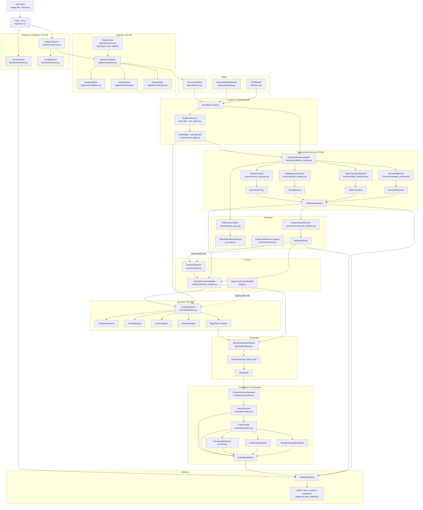

# V2.3 Architecture

**Status:** current, implemented, verified against code at commit `f792965`.
**Baseline for collaboration.** This document describes what exists today. Anything
labelled *proposed* or *future* does not exist in code.

---

## 3.1 System Overview

Image → Story is a multimodal system that turns a set of images into a grounded
creative story. Images pass through a collection-aware ingestion stage, vision
perception, and structured evidence extraction; entities are tracked into a
persistent world state; a hierarchical memory layer groups evidence into scenes,
persists entity identities across scenes, detects state transitions and builds
narrative memory. Retrieval and context building operate over that hierarchy rather
than over a flat evidence pool. A creative planner then produces a structured plan
(hard facts locked, soft inferences qualified, creative space free), a local LLM
writes the story, and every claim in the output is extracted, classified as
observed / inferred / creative, and verified against the evidence. Evaluation
reports grounding, contradiction, continuity and narrative-quality diagnostics.

### Conceptual pipeline (current)

```
Images
→ Ingestion
→ Vision
→ Evidence
→ World State
→ Collection Memory
→ Hierarchical Retrieval
→ Collection Context
→ Creative Planning
→ Story Generation
→ Claim Extraction
→ Verification
→ Evaluation
→ Artifacts
```

### The two execution paths (both current, both real)

| | Legacy path | Collection path (V2.3) |
|---|---|---|
| Entry | `run_single_image()`, `run_multi_image()` | `run_collection()` |
| Selection | default | `--collection-memory` / `use_collection_memory=True` |
| Retrieval | flat FAISS `EvidenceRetriever` | `HierarchicalRetriever` over `CollectionMemory` |
| Context | `ContextBuilder`, `SequenceContextBuilder` | `CollectionContextBuilder` |
| `artifacts.collection_memory` | `None` | populated |
| `artifacts.retrieval_result` | `None` | populated |

The legacy path is **never** silently upgraded to the collection path, and
`CollectionMemory` is injected into the retriever **only** on the collection path.

---

## 3.2 Full Architecture Diagram



Dotted lines = legacy-only components, not used on the collection path.

---

## 3.3 Runtime Call Graph (actual, verified)

Derived by AST inspection of the source, not inferred from filenames.

### Entry points

- CLI: `main_v2.py` → `main()` → `build_parser()`
- Python API: `image_story.create_orchestrator(config)` → `PipelineOrchestrator`
- Collection API: `image_story.collections.CollectionPipeline`

### Orchestrator construction

```
create_orchestrator(config: PipelineConfig) -> PipelineOrchestrator
PipelineOrchestrator.__init__(config)
    _initialize_components()                      # lazy, on first run
        Florence2Model(device).load()
        create_grounding_dino(...)                # if config.use_grounding_dino
        create_ocr(...)                           # if config.use_ocr
        create_embedding_model(device).load()
        FAISSVectorStore(embedding_model, device)
        EvidenceRetriever(embedding_model, vector_store)          # legacy
        create_collection_memory_builder(...)                    # V2.3
        create_hierarchical_retriever(...)                        # V2.3
        create_collection_context_builder(...)                    # V2.3
        WorldStateBuilder(); EvidenceRanker()
        ContextBuilder(); SequenceContextBuilder()                # legacy
        CreativePlanner(seed=..., creativity_config=..., genre=..., tone=...)
        create_generator("qwen", device)
        StoryGenerationPipeline(generator, config)
        VisualVerifier(...); ComprehensiveEvaluator(device)
```

Note: retrieval thresholds are injected by writing to the retriever's own config
(`_config.scene_similarity_threshold`, `_config.evidence_similarity_threshold`),
not passed per call.

### `PipelineOrchestrator.run_collection(image_paths, evaluate=True)` — actual sequence

```
 1  ExperimentManifest(run_id, config, seed, device)
 2  PipelineArtifacts(run_id, manifest)
 3  _initialize_components()                       (if not already done)
 4  Image.open(p).convert("RGB")                   for each path
 5  PERCEPTION
      self._florence.analyze(image, frame_id)      -> VisualObservations
      self._grounding.detect_with_phrases(...)    -> evidence_records.extend
      self._ocr.extract_text(...)                  -> evidence_records.extend
    artifacts.observations = all_observations
 6  COLLECTION MEMORY
      self._collection_memory_builder.build_from_observations(all_observations, config)
          WorldStateBuilder.add_observations_batch(observations)
          SceneGrouper.group_observations(observations, world_state)
          _index_evidence_with_provenance(...)     -> vector_store.add_batch_with_provenance
          EntityMemoryTracker.build_entity_memory(scenes, observations, world_state)
          EntityMemoryTracker.update_entity_state(entity_memories, scenes)
          StateTransitionDetector.detect_transitions(...)
          NarrativeMemory.build_narrative_elements(...)
          -> CollectionMemory;  _retriever.set_collection_memory(collection)
      self._hierarchical_retriever.set_collection_memory(self._collection_memory)
    artifacts.collection_memory = self._collection_memory
 7  self._world_builder.add_observations_batch(all_observations)   -> artifacts.world_state
 8  RETRIEVAL  (query built from scene + characters + od_labels)
      self._hierarchical_retriever.retrieve_full(query, top_k_scenes,
                                                  top_k_evidence_per_scene,
                                                  include_transitions=True,
                                                  include_narrative=True)
    artifacts.retrieval_result = retrieval_result
    artifacts.retrieved_evidence = [RetrievedEvidence(record=e, ...) for e in ...]
 9  RANKING
      EvidenceRanker.rank_for_story_planning(retrieved, query, last_frame, recurrence)
      EvidenceRanker.select_for_context(ranked, max_tokens)
    artifacts.ranked_evidence = ranked
10  PLANNING
      CreativePlanner.create_creative_plan(world_state, all_observations, ranked,
                                           collection_memory=..., retrieval_result=...)
      CreativePlanner.create_story_plan(creative_plan, target_story_words)
    artifacts.creative_plan / artifacts.story_plan
11  CONTEXT
      CollectionContextBuilder.build_collection_context(collection_memory,
                                                        retrieval_result,
                                                        creative_plan,
                                                        current_scene_id=<last scene>)
      CollectionContextBuilder.build_multi_scene_prompt(context, creative_plan, target_words)
    artifacts.context = context
12  GENERATION
      StoryGenerationPipeline.generate_story(prompt, story_plan) -> StoryDraft
    artifacts.story_draft
13  EVALUATION  (if evaluate)
      ComprehensiveEvaluator.evaluate(artifacts, images[0])
          ClaimExtractor.extract_claims(story, caption)
          ClaimVerifier.verify_claims(...)  or  _textual_verification_batch(...)
          ClaimVerifier.compute_claim_grounding_score(results)
          GroundingEvaluator.evaluate(image, caption, story)      # CLIP + NLI
          ContinuityEvaluator.evaluate_continuity(...)             # if >1 observation
          NarrativeQualityEvaluator.evaluate_narrative_quality(...)
          -> EvaluationResult ; sets artifacts.claims / artifacts.verification_results
    artifacts.evaluation
```

### `CollectionPipeline` flow

```
CollectionPipeline.process_collection(collection, evaluate, save_dir, use_collection_memory)
    IngestionPipeline.process_collection(collection, processing_config)
        validate_images(); compute_hashes(); deduplicate()
    collection.get_valid_sorted(ordering_mode) -> valid_images
    if use_collection_memory:  orchestrator.run_collection(image_paths, evaluate)
    else:                      orchestrator.run_multi_image(image_paths, evaluate)
    StorySession(...)  ;  save_artifacts(artifacts, save_path)
    -> dict(success, session_id, story, word_count, evaluation, timings)
```

### Claim verification routing (actual)

```
ComprehensiveEvaluator.evaluate(artifacts, image)
    claims = ClaimExtractor.extract_claims(story, caption)
    if image is not None:  ClaimVerifier.verify_claims(claims, image, evidence)
                           -> per claim: VisualVerifier.verify_claim(...)
    else:                   ClaimVerifier._textual_verification_batch(claims, evidence)
```

`run_collection` passes `images[0]`, so collection runs use the **visual** path.
`ClaimVerifier.repair_story` exists but is **not** invoked by `run_collection` or
`run_multi_image`; minimal repair is available as an API but is not on the
automatic production path.

---

## 4. Domain Contracts

All models are dataclasses in `src/image_story/domain/schemas.py` unless noted.
Hierarchical memory models live in `src/image_story/memory/hierarchical.py`.

### Collection & session models (V2.3A)

| Model | Purpose / key fields | Producer | Consumer | Lifecycle |
|---|---|---|---|---|
| `StorySession` | Tracks a generation run over a collection. `session_id`, `collection_id`, `status` (pending/queued/processing/completed/partial_success/failed/cancelled), `pipeline_mode`, `config_snapshot`, `artifacts_ref`, `error`, `processing_summary` | `CollectionPipeline` | caller / persistence | created per run → status transitions → archived |
| `ImageCollection` | Ordered set of `ImageRecord`. `collection_id`, `images`, `ordering_mode` (auto/upload_order/filename/timestamp/unordered), `total_images`, `valid_images` | `IngestionPipeline.create_collection_from_paths`, `CollectionPipeline` | ingestion, orchestrator | created → populated → read once per run |
| `ImageRecord` | One image with validation/dedup state. `image_id`, `path`, `sequence_index`, `content_hash`, `perceptual_hash`, `validation_status`, `processing_status`, `duplicate_of`, `similar_to`, `error` | `IngestionPipeline` | validation / hashing / dedup | created → validated → hashed → deduped → consumed |
| `ProcessingJob` | Per-image or batch job record. `job_id`, `collection_id`, `image_ids`, `status`, `stage`, `retry_count`, `max_retries`, `progress` | reserved for job orchestration | resume/retry logic | defined; job emission is not on the current synchronous path |
| `ProcessingConfig` | Plain config class: `resume`, `retry_failed`, `force_reprocess`, `skip_validation`, `skip_deduplication`, `max_retries`, `retry_delay_seconds` | caller | `IngestionPipeline` | per-run |
| `CollectionPipelineConfig` | `mode`, `ordering_mode`, `processing`, `pipeline_config`, `cache_dir`, `artifacts_dir`, `max_images` (1000), `skip_validation`, `skip_deduplication`, `max_images_per_batch` (10) | caller | `CollectionPipeline` | per-run |

### Perception & evidence models

| Model | Purpose / key fields | Producer | Consumer | Lifecycle |
|---|---|---|---|---|
| `VisualObservations` | One image's perception output. `image_id`, `frame_id`, `scene`, `detailed_caption`, `characters`, `od_labels`, `actions`, `spatial_relations`, `region_descriptions`, `style_or_mood`, `ocr_text`, `grounding_detections`, `evidence_records` | `Florence2Model.analyze` (+ GroundingDINO/OCR enrichment) | world state, memory builder, ranker, evaluator | created per frame → aggregated → retained in artifacts |
| `EvidenceRecord` | One atomic observation with provenance. `id`, `entity`, `type` (`EvidenceType`), `action`, `relationship`, `frame_id`, `bbox`, `confidence`, `confidence_class`, `source`, `evidence_text`, `provenance`, `information_class` (`InformationClass`), `sequence_position` | vision models; OCR | everything downstream | immutable leaf; the atom of all provenance |
| `WorldState` | Entities across frames. `characters`, `objects`, `locations`, `goals`, `relationships`, `open_loops`, `previous_events`, `frame_count`; helpers `get_all_entities()`, `get_entity_by_label()`, `get_disappeared_entities()`, `get_recurring_entities()` | `WorldStateBuilder` | planner, continuity evaluator | rebuilt per run |
| `WorldEntity` | One tracked entity. `id`, `label`, `entity_type`, `first_frame`, `last_frame`, `frames_present`, `attributes`, `bounding_boxes`, `is_recurring`, `disappearance_frame` | `WorldStateBuilder` | planner, foreshadowing | per run |

### Hierarchical memory models (V2.3B)

| Model | Purpose / key fields | Producer | Consumer | Lifecycle |
|---|---|---|---|---|
| `CollectionMemory` | Aggregate hierarchical memory. `collection_id`, `scene_summaries`, `global_entities` (keyed by `normalized_label`), `state_transitions`, `narrative_elements`, `total_images`, `total_evidence`, timestamps; helpers `get_scene()`, `get_scenes_by_entity()` | `CollectionMemoryBuilder.build_from_observations` | `HierarchicalRetriever`, `CollectionContextBuilder`, `CreativePlanner`, artifacts | built once per collection run → injected into retriever → serialized |
| `SceneSummary` | One scene. `scene_id`, `image_ids`, `frame_indices`, `dominant_entities`, `important_objects`, `actions`, `location`, `environment`, `recurring_entities`, `key_evidence_ids`, `summary_text`, `embedding`, `evidence_count`, `start_frame`, `end_frame`, `timestamp` | `SceneGrouper` | retriever, context builder, narrative memory | immutable after build |
| `EntityMemory` | Entity identity across scenes. `entity_id`, `normalized_label`, `aliases`, `entity_type`, `first_seen_scene`, `last_seen_scene`, `scene_ids`, `image_ids`, `evidence_ids`, `confidence`, `state` (present/disappeared/reappeared/moved), `attributes`, `bounding_boxes` | `EntityMemoryTracker` | retriever, transitions, narrative memory, planner | mutable during build; finalized after merge |
| `StateTransition` | A detected change. `transition_id`, `entity_id`, `entity_label`, `transition_type`, `from_scene`, `to_scene`, `from_frame`, `to_frame`, `description`, `confidence`, `evidence_ids` | `StateTransitionDetector` | narrative memory, context builder, retriever | immutable |
| `NarrativeElement` | Callback/foreshadowing candidate. `element_id`, `element_type`, `label`, `description`, `first_scene`, `last_scene`, `scene_ids`, `evidence_ids`, `recurrence_count`, `narrative_importance`, `associated_entities`, `potential_callback`, `callback_payoff_scene` | `NarrativeMemory` | context builder, planner callback planning | immutable after scoring |
| `RetrievalResult` | Multi-level retrieval output. `scenes`, `evidence`, `entities`, `transitions`, `narrative_elements`, `query`, `retrieval_time_ms`; `to_dict()`/`from_dict()` | `HierarchicalRetriever.retrieve_full` | context builder, planner, artifacts | per query |
| `IndexedEvidenceRecord` | Evidence + provenance at index time. `evidence`, `image_id`, `scene_id`, `frame_id`, `collection_id`, `index_position` | `FAISSVectorStore.add_*_with_provenance` | scene/entity/image filtered search | lifetime of the index |

### Enumerated values actually emitted in code

`StateTransition.transition_type` — emitted by `StateTransitionDetector`:
`appeared`, `disappeared`, `moved`, `changed_relationship`, `changed_state`,
`reappeared`. (A `changed_scene` value appears in a code comment but is **never
emitted**; do not branch on it.)

`NarrativeElement.element_type` — emitted by `NarrativeMemory`:
`recurring_entity`, `scene_character`, `scene_object`, `open_loop`, plus the
transition-derived `object_disappearance`, `object_reappearance`,
`relationship_change`, `state_change`, `movement`, and `transition` as the
fallback for an unrecognised transition type.

### Narrative, generation, verification, evaluation models

| Model | Purpose / key fields | Producer | Consumer | Lifecycle |
|---|---|---|---|---|
| `CreativePlan` | Structured creative direction. `genre`, `tone`, level knobs, `characters`, `central_conflict`, `open_loops`, `foreshadowing_elements`, `callback_plan`, `narrative_arc`, `hard_facts`, `soft_inferences`, `locked_facts`, `creative_budget` | `CreativePlanner.create_creative_plan` | story plan, context builder, evaluator | per run |
| `StoryBeat` | One beat. `beat_number`, `beat_type`, `description`, `key_entities`, `key_evidence_ids`, `creative_elements`, `target_words` | `CreativePlanner.create_story_plan` | generation | per plan |
| `StoryPlan` | 7 beats + owning `creative_plan` + `target_total_words` | `CreativePlanner.create_story_plan` | `StoryGenerationPipeline` | per run |
| `StoryDraft` | Generated text. `text`, `story_plan`, `word_count`, `generation_time_s`, `model_used`, `prompt_used` | `StoryGenerationPipeline.generate_story` | claim extractor, evaluator | terminal output |
| `StoryClaim` | One extracted claim. `id`, `subject`, `relation`, `object`, `original_sentence`, `claim_type`, `claim_classification` (observed/inferred/creative), `evidence_ids`, `confidence` | `ClaimExtractor.extract_claims` | `ClaimVerifier`, evaluator | per story |
| `VerificationResult` | Per-claim verdict. `claim_id`, `claim`, `status` (supported/unsupported/contradicted), `supporting_evidence`, `contradicting_evidence`, `confidence`, `notes` | `ClaimVerifier` | evaluator, grounding score | per claim |
| `EvaluationResult` | Metric bundle. grounding/CLIP/NLI, `claim_support_rate`, `claim_grounding_score`, `continuity_score`, `narrative_coherence`, `contradicted_claims`, `supported_claims`, `unsupported_claims`, timing fields | `ComprehensiveEvaluator.evaluate` | caller, `save_artifacts` | per run |
| `ExperimentManifest` | Reproducibility record. `run_id`, `git_commit`, `vision_model`, `language_model`, `embedding_model`, `dataset`, `dataset_hash`, `seed`, `device`, `config`, `timestamp`. **Only `run_id`, `config`, `seed`, `device` are currently populated by the orchestrator** | `PipelineOrchestrator` | artifacts | per run |
| `PipelineArtifacts` | Everything a run produced: `run_id`, `manifest`, `observations`, `world_state`, `retrieved_evidence`, `ranked_evidence`, `context`, `creative_plan`, `story_plan`, `story_draft`, `claims`, `verification_results`, `evaluation`, `runtime`, `logs`, `collection_memory`, `retrieval_result` | `PipelineOrchestrator` | `save_artifacts`, evaluator | per run |

---

## 5. Evidence Contract

The system separates three things that are easy to conflate.

### OBSERVED / INFERRED / CREATIVE

`StoryClaim.claim_classification` takes exactly three values, emitted by
`ClaimExtractor._classify_claim_classification`:

| Value | Meaning | Grounding consequence |
|---|---|---|
| `observed` | A directly visible visual fact ("the girl is holding a balloon") | Must be supported by evidence; a contradiction is a real defect |
| `inferred` | A qualified interpretation of what was seen ("the balloon appeared to be red") | Softer; scored at half weight |
| `creative` | Narrative invention: personality, motivation, humour, metaphor, dialogue, tone, foreshadowing | Never penalised; excluded from the grounding denominator |

`ClaimVerifier.compute_claim_grounding_score` implements this: `creative` claims are
`continue`d (skipped entirely), `observed` claims count fully when supported and
subtract when contradicted, `inferred` claims count at 0.5.

### The underlying evidence taxonomy

`EvidenceRecord.information_class` (`InformationClass`) is a separate, orthogonal axis:

- `hard_fact` — locked. Derived from perception. Used for `locked_facts`.
- `soft_inference` — qualified interpretation from perception.
- `creative_space` — creative content, not an evidence claim.

### The governing rule

> **Creative freedom must not be confused with permission to contradict visual evidence.**

Concretely, enforced by `CreativePlan.creative_budget`:

| Budget class | Default max | Covers |
|---|---|---|
| `safe_creative` | 8 | personality, humour, dialogue, metaphor |
| `risky_inferred` | 3 | motivations, uncertain actions |
| `forbidden_visual` | 0 | new objects, colours, materials, people |

`locked_facts` (derived from `hard_fact` evidence) must not be contradicted. The
narrative layer may invent freely *around* the evidence; it may not invent
*against* it.

---

## 6. Memory Architecture

### Layering

```
IMAGE
  ↓  VisualObservations (characters, od_labels, actions, scene)
EVIDENCE
  ↓  EvidenceRecord (entity, type, frame_id, confidence, information_class)
SCENE
  ↓  SceneSummary (image_ids, frame_indices, dominant_entities, key_evidence_ids, embedding)
COLLECTION
  ↓  CollectionMemory (scenes + global_entities + state_transitions + narrative_elements)
```

Each layer keeps the identity of the layer below: scenes keep `image_ids` and
`frame_indices`; evidence keeps `frame_id`; `IndexedEvidenceRecord` keeps
`image_id` + `scene_id` + `frame_id` + `collection_id` + `index_position`.

### Components

- **Embeddings** — `memory/embeddings.py`. `SentenceTransformerEmbedding` wrapping
  `minilm-l6`-class models, exposing `encode_single(text)` and `encode(texts)`.
- **FAISS** — `memory/faiss_store.py`. `flat_ip`, `flat_l2`, `hnsw` index types.
  Holds two parallel maps: a legacy `evidence_map` and a provenance-aware
  `_indexed_evidence`. Maintains `_scene_to_indices`, `_entity_to_indices`,
  `_image_to_indices` for filtered lookup. Supports `search`, `search_by_scene`,
  `search_by_entity`, `search_by_embedding`, and `*_with_provenance` insertion, plus
  `save`/`load`.
- **Scene grouping** — `memory/scene_grouper.py`. Embeds each observation, builds a
  combined similarity matrix (semantic similarity + entity-overlap Jaccard), then
  greedily clusters. Falls back to sequential windowing when clustering fails
  validation or when `use_sequence_fallback` is set.
- **Entity persistence** — `memory/entity_memory.py`. Seeds identities from
  `WorldState`, enhances from per-frame evidence, enhances again from
  `world_state.frames_present` for recurring entities, then merges label/alias-
  equivalent entities. Scene overlap alone is deliberately **not** sufficient to
  merge (two different characters can share a scene).
- **State transitions** — `memory/state_transitions.py`. Detects appeared,
  disappeared, moved (bbox IoU), changed_relationship, changed_state, reappeared.
- **Narrative memory** — `memory/narrative_memory.py`. Builds `NarrativeElement`s
  from recurring entities, transitions, scene contents and open loops; scores
  `narrative_importance`; marks callback potential and payoff scenes.
- **Retrieval** — `memory/hierarchical_retriever.py`. `retrieve_full()` returns
  scenes → evidence within scenes → entities → transitions → narrative elements.
  Scene selection uses cosine similarity against `scene_similarity_threshold`, with
  a fallback to top-k scenes when nothing clears the threshold.
- **Context compression** — `context/collection_builder.py`. Emits budgeted sections
  (collection overview, relevant scenes, current-scene detail, key entities, state
  transitions, narrative elements, hard facts, creative direction) truncated to
  `max_total_words`.

### How provenance is preserved

1. Every perception output becomes an `EvidenceRecord` with a stable `id`.
2. `CollectionMemoryBuilder._index_evidence_with_provenance` inserts each record into
   FAISS via `add_batch_with_provenance`, creating an `IndexedEvidenceRecord` that
   binds `evidence_id → image_id + scene_id + frame_id + collection_id + index_position`.
3. `SceneGrouper` copies contributing evidence ids into `SceneSummary.key_evidence_ids`.
4. `EntityMemory` accumulates `scene_ids`, `image_ids` and `evidence_ids`.
5. `StateTransition` and `NarrativeElement` carry `evidence_ids` and scene ids.
6. `RetrievalResult` returns the concrete records, so any retrieved item can be
   resolved back to a scene and an image.

---

## 7. Current Provenance (verified, with limits)

### Chain that is verified working

```
StoryClaim
  ↓  VerificationResult.claim            (claim_id ↔ claim)
  ↓  VerificationResult.supporting_evidence
EvidenceRecord
  ↓  EvidenceRecord.id present in VisualObservations.evidence_records
VisualObservations  (image_id, frame_id)
  ↓  image_id ∈ SceneSummary.image_ids  and  frame_id ∈ SceneSummary.frame_indices
SceneSummary
  ↓  key_evidence_ids / image_ids
Image / frame
```

`tests/integration/test_v23c_runtime_proof.py::TestProvenanceChain` asserts each hop
against a real executed `run_collection()` run.

### Verified limitations — do not overstate

1. **`StoryClaim.evidence_ids` is never populated.** Verified: the string
   `evidence_ids` does not appear anywhere in `src/image_story/evaluation/claims.py`.
   `ClaimExtractor` constructs `StoryClaim(...)` without it, so it stays `[]`. The
   claim→evidence link is carried entirely by `VerificationResult.claim` and
   `.supporting_evidence`. There is a test that asserts this gap still exists so it
   cannot be mistaken for a working link.
2. **`StoryDraft` has no scene/entity attribution.** It holds `text`, `story_plan`,
   `prompt_used` only. Mapping a sentence to the scene that motivated it requires
   re-deriving it from claim evidence; no direct field exists.
3. **`ExperimentManifest` is partially populated** (see §4). Manifests are not
   sufficient for bit-level reproducibility.
4. **Evaluation consumes only the first image.** `run_collection` calls
   `evaluate(artifacts, images[0])`, so CLIP-based grounding scores the story
   against image 0 only, even for multi-image collections.
5. **Per-scene evaluation attribution is absent.** Continuity is computed from
   `VisualObservations`, not from `SceneSummary`, so scene boundaries do not
   influence evaluation.

No stronger provenance claim is supported by the current code.

---

## 8. V2.2 → V2.3 Compatibility

### Backward compatible and unchanged

- `run_single_image(image_path, evaluate)` — legacy single-image path, unchanged
  behaviour: `ContextBuilder` + `EvidenceRetriever` + `ContextBuilder.build_story_prompt`.
- `run_multi_image(image_paths, evaluate)` — legacy sequence path, unchanged:
  `EvidenceRetriever.retrieve_for_story_planning` + `EvidenceRanker.rank_for_story_planning`
  + `SequenceContextBuilder`.
- **Legacy flat retrieval** — `memory/retrieval.py` `EvidenceRetriever` is intact and
  still used by both legacy paths. Nothing was removed.
- **Grounded creativity** — `CreativePlan.hard_facts`, `soft_inferences`,
  `locked_facts` and `creative_budget` are unchanged.
- **Claim classification** — OBSERVED / INFERRED / CREATIVE unchanged.
- **Creative budget** — defaults still `safe_creative=8`, `risky_inferred=3`,
  `forbidden_visual=0`.
- **Minimal repair** — `ClaimVerifier.repair_story` still repairs only contradicted
  *observed* claims, and leaves creative/inferred content alone. (It is an API, not
  automatically invoked.)
- **Evaluation** — `ComprehensiveEvaluator` behaviour unchanged.

### How the two paths differ

| Aspect | LEGACY PATH | V2.3 COLLECTION PATH |
|---|---|---|
| Trigger | default | `--collection-memory` or `use_collection_memory=True` |
| Memory built | none (flat index only) | `CollectionMemory` (scenes/entities/transitions/narrative) |
| Retrieval | `EvidenceRetriever.retrieve*` | `HierarchicalRetriever.retrieve_full` |
| Planner input | world state + observations + ranked evidence | same **plus** `collection_memory` and `retrieval_result` |
| Context | `ContextBuilder` / `SequenceContextBuilder` | `CollectionContextBuilder` |
| Callbacks planned from | `world_state` recurring entities | narrative elements + recurring entities (`_plan_callbacks_v23`) |
| Artifacts memory fields | `None` | populated |
| Guarantees | flat retrieval is not bypassed | flat retrieval is **not** used (`retrieve_for_story_planning` call count is asserted 0) |

Both paths run the same `CreativePlanner`, `StoryGenerationPipeline`,
`ClaimExtractor`, `ClaimVerifier` and `ComprehensiveEvaluator`.

---

## 9. Configuration Contract

All values below were read from live code, not estimated.

### `PipelineConfig` — V2.3 parameters (`domain/schemas.py`)

| Parameter | Default | Purpose |
|---|---|---|
| `scene_similarity_threshold` | `0.65` | Passed to `SceneGroupConfig.similarity_threshold` when constructing the `CollectionMemoryBuilder`; governs scene clustering |
| `max_scene_size` | `20` | Also a `PipelineConfig` field; note the builder currently forwards only `similarity_threshold`, so `SceneGroupConfig.max_scene_size` keeps its own default of `20` |
| `top_k_scenes` | `5` | Forwarded to `create_hierarchical_retriever` and to `retrieve_full(top_k_scenes=...)`; caps scenes retrieved |
| `top_k_evidence_per_scene` | `10` | Forwarded to the retriever and to `retrieve_full(top_k_evidence_per_scene=...)`; caps evidence per scene |
| `scene_retrieval_threshold` | `0.5` | Injected into `HierarchicalRetrievalConfig.scene_similarity_threshold`; cosine floor for scene selection |
| `evidence_retrieval_threshold` | `0.4` | Injected into `HierarchicalRetrievalConfig.evidence_similarity_threshold` |
| `max_scenes_in_context` | `5` | Forwarded to `create_collection_context_builder(max_scenes=...)` → `CollectionContextConfig.max_scenes_in_context` |

Other relevant `PipelineConfig` fields: `mode`, `use_grounding_dino`, `use_ocr`,
`use_faiss`, `use_creative_planner`, `use_verification`, `max_evidence_per_frame` (50),
`faiss_top_k` (10), `context_max_words` (500), `target_story_words` (250),
`creativity_config`, `creative_budget`, `genre` ("whimsical"), `tone` ("comedic"),
`seed` (0), `device` ("cpu").

`max_total_evidence` for the retriever is derived as `config.faiss_top_k * 5` (50).

### `SceneGroupConfig` (`memory/scene_grouper.py`)

| Field | Default |
|---|---|
| `similarity_threshold` | `0.65` |
| `min_scene_size` | `1` |
| `max_scene_size` | `20` |
| `use_sequence_fallback` | `True` |
| `sequence_window` | `5` |
| `entity_overlap_weight` | `0.4` |
| `semantic_similarity_weight` | `0.6` |

### `HierarchicalRetrievalConfig` (`memory/hierarchical_retriever.py`)

| Field | Default |
|---|---|
| `top_k_scenes` | `5` |
| `top_k_evidence_per_scene` | `10` |
| `max_total_evidence` | `50` |
| `scene_similarity_threshold` | `0.5` |
| `evidence_similarity_threshold` | `0.4` |
| `include_transitions` | `True` |
| `include_narrative_elements` | `True` |
| `max_context_tokens` | `2000` |

### `CollectionContextConfig` (`context/collection_builder.py`)

| Field | Default |
|---|---|
| `max_scenes_in_context` | `5` |
| `max_evidence_per_scene` | `8` |
| `max_entities` | `10` |
| `max_transitions` | `8` |
| `max_narrative_elements` | `6` |
| `max_total_words` | `800` |
| `include_scene_summaries` | `True` |
| `include_entity_profiles` | `True` |
| `include_transitions` | `True` |
| `include_callbacks` | `True` |
| `prioritize_current_scene` | `True` |

---

## 10. Test Contract

**Authoritative count: 233 collected** (`pytest --collect-only -q` at `f792965`).

| Group | File | Tests |
|---|---|---|
| V2.2 unit | `tests/unit/test_schemas.py` | 21 |
| V2.2 unit | `tests/unit/test_context.py` | 8 |
| V2.2 unit | `tests/unit/test_narrative.py` | 10 |
| V2.2 regression | `tests/regression/test_grounded_creativity_v21.py` | 14 |
| V2.3B unit | `tests/unit/test_hierarchical_schemas.py` | 24 |
| V2.3B unit | `tests/unit/test_faiss_collection.py` (incl. 3 scale tests) | 20 |
| V2.3B unit | `tests/unit/test_narrative_context.py` | 16 |
| V2.3B unit | `tests/unit/test_scene_grouper.py` | 14 |
| V2.3B unit | `tests/unit/test_entity_state.py` | 14 |
| V2.3B unit | `tests/unit/test_hierarchical_retriever.py` | 12 |
| V2.3C integration | `tests/integration/test_v23c_integration.py` | 17 |
| V2.3C runtime proof | `tests/integration/test_v23c_runtime_proof.py` | 63 |
| **Total** | | **233** |

### What each layer guarantees

- **V2.2 regression** (`tests/regression/`) — claim classification, creative budget,
  locked facts in prompt, grounded humour/surprise. These are the behavioural
  contract that must not regress.
- **V2.3B unit** — scene grouping, entity memory, state transitions, narrative
  memory, hierarchical retrieval, provenance records, scale limits.
- **V2.3C integration** — component-level wiring and grounded-creativity
  preservation inside collection mode.
- **V2.3C runtime proof** — executes the real `run_collection()`. Only model
  boundaries are stubbed (Florence2, embeddings, Qwen, CLIP/NLI, VisualVerifier
  CLIP). A transparent `Spy` wraps each real component and delegates, so the real
  implementations run while invocations and arguments are recorded. It asserts real
  objects flow between stages, and it guards that flat FAISS retrieval is *not* used.

### Runtime-proof sensitivity

The runtime-proof suite was validated by mutation testing: disabling
`CollectionMemoryBuilder`, `HierarchicalRetriever`, `CollectionContextBuilder`,
`CreativePlanner`, generation, or evaluation — and reintroducing flat FAISS retrieval
— each causes failures (9/9 mutations detected). It also has static guards against
the two latent defects previously found in `run_single_image()`.

### Model dependence

- `tests/unit/` and `tests/integration/test_v23c_runtime_proof.py` are
  **model-independent**: 202 tests pass with `HF_HUB_OFFLINE=1`.
- `tests/integration/test_v23c_integration.py` (17) and `tests/regression/` (14)
  construct real sentence-transformer embeddings and require a Hugging Face cache or
  network on first use.

---

## 11. Performance / Scale Contract

### Verified measurements

From `python benchmarks/scale_benchmark.py` (CPU, `minilm-l6`-class embeddings,
5 evidence records per synthetic frame). These are the only measured numbers
available; they are synthetic, not real-image, benchmarks.

| Records | Frames | Memory build | FAISS insert | Retrieval mean | Context | Planner | Context words |
|---|---|---|---|---|---|---|---|
| 500 | 100 | 19.230 s | 14.704 s | 79.1 ms | 0.001 s | 0.003 s | 425 |
| 5000 | 1000 | 77.041 s | 311.726 s | 123.8 ms | 0.001 s | 0.013 s | 425 |

Retrieval percentiles at 5000 records: mean 123.8 ms, P50 117.2 ms, P95 140.3 ms.
Peak RSS during memory build at 5000 records: ~36 MB.

In-suite scale tests (`TestPerformanceScaling`, 0.01–0.04 s each) use a
deterministic mock embedding model, so they assert *architectural* limits
(`add < 1.0 s`, `search < 0.1 s`) rather than real model latency.

### Complexity

| Stage | Complexity | Note |
|---|---|---|
| Scene grouping | **O(N²)** | `scene_grouper.py` builds a full pairwise similarity matrix, then a greedy loop over all `j > i` |
| Entity merge | O(E²) | pairwise `_entities_match` over entity memories |
| Narrative memory | O(E × elements) | plus an O(E) uniqueness recount inside importance scoring |
| FAISS insertion | O(R) encodes, unbatched | `add_evidence_with_provenance` calls `encode_single` per record → **the dominant cost at scale** |
| Retrieval | ~O(S·K) scene scan + per-scene FAISS search | flat index search is O(R) |
| Context build | O(R) scan, truncated to budget | output stays ~425 words regardless of collection size |
| Ranking | O(R log R) | |

### Explicit non-claims

- **No 100K-scale production readiness is claimed.** Largest verified run is 5000
  evidence records / 1000 synthetic frames.
- Scene grouping is currently **O(N²)**; at 1000 frames this is already the second
  largest cost and will dominate at 10K+.
- FAISS insertion is currently the **largest** cost and is not batched.
- All scale data is synthetic; no large-scale empirical validation on real image
  collections has been performed.
- Retrieval latency numbers come from synthetic embedding similarity, so they do not
  predict real-image retrieval quality.

---

## 12. Known Limitations

| Limitation | Severity | Current State | Future Owner |
|---|---|---|---|
| `StoryClaim.evidence_ids` never populated | **High** | Field exists and is serialized, but `ClaimExtractor` never writes it; `evidence_ids` does not appear in `claims.py`. Claim→evidence link is carried by `VerificationResult` instead. Guarded by a test asserting the gap | Narrative/Reasoning (with A for schema) |
| `StoryDraft` has no scene/entity attribution | **High** | No field links a sentence/beat to a scene; must be re-derived from claim evidence | Narrative/Reasoning |
| `ExperimentManifest` partially populated | Medium | Only `run_id`, `config`, `seed`, `device` set; `git_commit`, model names, `dataset*` stay `""` | Developer A |
| Vision cache inactive | Medium | `VisionCache` and `CacheEntry` exist and are exported, but never instantiated in orchestrator/collections/ingestion | Developer A |
| Scene grouping O(N²) | Medium | Full pairwise similarity matrix; visible cost at 1000 frames | Developer A |
| FAISS insertion per-item encoding | **High** | 311.7 s for 5000 records; `encode_single` called per record instead of batched `encode` | Developer A |
| Entity merge O(E²) | Low–Medium | Pairwise label/alias comparison | Developer A |
| Minimal repair not on automatic path | Medium | `ClaimVerifier.repair_story` exists but is not invoked by `run_collection`/`run_multi_image` | Narrative/Reasoning |
| Evaluation uses only first image | Medium | `evaluate(artifacts, images[0])`; CLIP grounding ignores other frames | Developer A + B |
| `ProcessingJob` not emitted | Low | Model defined; the synchronous path never creates job records | Developer A |
| Scene-level evaluation attribution absent | Low | Continuity is computed from observations, not scenes | Developer B |
| Legacy path duplicates some orchestration | Low | `run_collection` re-implements stage sequencing that `run_multi_image` also has; changes must be mirrored deliberately | Developer A |
| Synthetic-only scale evidence | Medium | No real-image large-scale validation | Shared |

---

## 13. Proposed Combined V3 Architecture

> **⚠️ FUTURE ARCHITECTURE — NOT CURRENT IMPLEMENTATION.**
> Nothing in this section exists in the codebase at `f792965`. Every subsystem below
> marked *(future)* is unbuilt. This is a proposal for Developer B's work and a target
> for integration, not a description of behaviour. Do not write documentation, tests,
> or code against these names as though they were available.

```
IMAGE(S)
→ INGESTION                                     [current]
→ MULTI-PASS VISION                             (future)
→ VISUAL EVIDENCE                               [current]
→ TEMPORAL WORLD MODEL                          (extended, future)
→ HIERARCHICAL MEMORY                           [current]
→ HIERARCHICAL RETRIEVAL                        [current]
→ CAUSAL EVENT RECONSTRUCTION                  (future — Developer B)
→ NARRATIVE POSSIBILITY SPACE                   (future — Developer B)
→ NARRATIVE OPTIMIZER                           (future — Developer B)
→ 7-BEAT BLUEPRINT                              [current, extendable]
→ MULTIPLE STORY CANDIDATES                     (future — Developer B)
→ BIDIRECTIONAL VERIFICATION                    (future — Developer B)
→ MULTI-OBJECTIVE EVALUATION                    (future — Developer B)
→ TARGETED REPAIR                               (partly current: repair_story exists, not automated)
→ RE-VERIFY                                     (future — Developer B)
→ FINAL STORY                                   [current]
→ EVIDENCE + METRICS PACKAGE                    [current, extendable]
```

| Subsystem | State | Owner |
|---|---|---|
| Ingestion | current | A |
| Multi-pass vision | **future** | A |
| Visual evidence | current | A |
| Temporal world model | current (WorldState); temporal extension **future** | A |
| Hierarchical memory | current | A |
| Hierarchical retrieval | current | A |
| Causal event reconstruction | **future** | B |
| Narrative possibility space | **future** | B |
| Narrative optimizer | **future** | B |
| 7-beat blueprint | current | A (shared) |
| Multiple story candidates | **future** | B |
| Bidirectional verification | **future** (current verifier is one-directional: story→evidence) | B |
| Multi-objective evaluation | **future** (current evaluator aggregates fixed metrics) | B |
| Targeted repair | API exists; **automation future** | B |
| Re-verify after repair | **future** | B |
| Evidence + metrics package | current | A (shared) |

**Integration constraint:** the V3 chain must not fork the V2.3 pipeline. New stages
belong *between* `HierarchicalRetriever` and `CreativePlanner`, or *after*
`ComprehensiveEvaluator`, with `EvidenceRecord` and the evidence contract unchanged.
Any new stage that emits claims must emit `StoryClaim` with the same three-way
classification.

---

## 14. Validation of This Document

Every current-behaviour statement above was checked against code at `f792965`:

- runtime graph — extracted from the AST of `run_collection`, not read from filenames
- public entry points — introspected via `inspect` on the real classes
- data models — introspected via `dataclasses.fields` on the real classes
- configuration names and defaults — introspected from live instances
- test counts — `pytest --collect-only -q`
- provenance — verified by executing the runtime-proof suite, plus a literal
  `evidence_ids` search in `claims.py`
- limitations — each one confirmed by inspecting the specific code path

Where this document and the code disagree, the code is correct and this document is
wrong; please open an issue rather than trusting the prose.